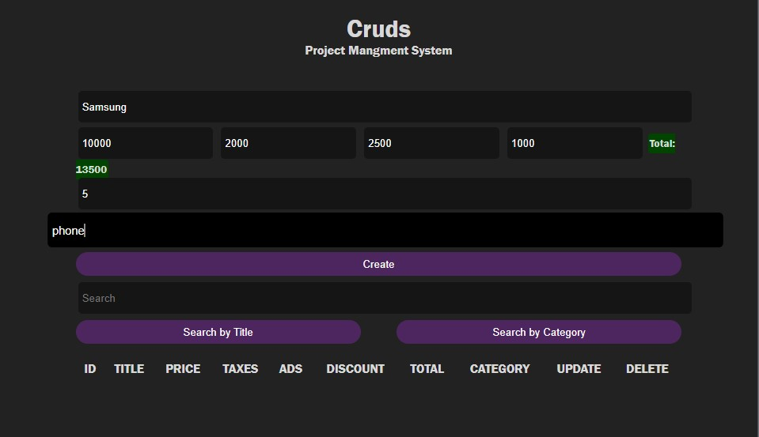
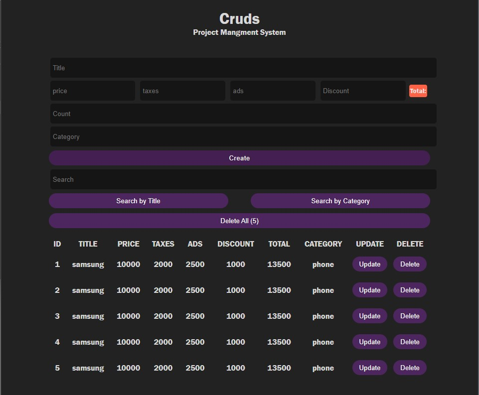

## Crud
In computer programming, create, read, update, and delete (CRUD) are the four basic operations of persistent storage. CRUD is also sometimes used to describe user interface conventions that facilitate viewing, searching, and changing information using computer-based forms and reports.
 
this site gives the user the ability to create an object and giving the properties of the title ,price ,ads ,taxes ,category of the object and saves it locally to the device and gives the user the ability to add multiple of tuples oft the same object and the search the database for specific tuples.

